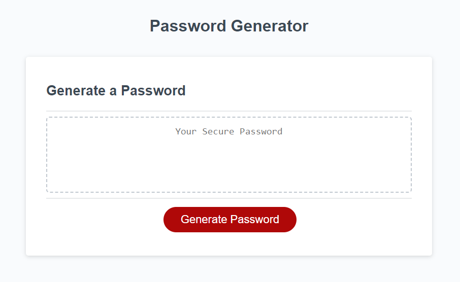

# Password Generator

## Description

This project is to create an application that randomly generates a password at least 8 and no more than 128 characters in length.
The application asks the chriteria of using upper-case, lower-case, numeric, and/ or special characters. 
After generating the password given the user's selection, it puts the newly generated password into the read only display.

## Installation

n/a

## Usage

Generates a password randomly given the input of the user.
Sets the parameters by prompts of upper case, lower case, numbers and/or special characters.

## Credits

n/a

## License

See license in repo.
